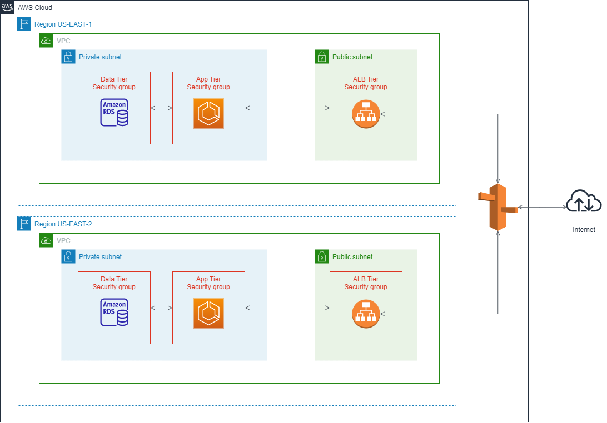

# AWS-assignment

This repo is used for AWS assignment, which includes several AWS CDK projects and a webapp for demo purpose.

The webapp is a simpele CRUD NodeJS application and interacts with MYSQL database. It allows end user add/edit/delete players from the browser. All the data is saved in database table `players`. 

All CDK projects have similar architecture with a little difference to fit specific purpose. The basic infrastructure as below shows.

Main components:

- Multiple regions & Three tiers network architecture
- Amazon RDS - MYSQL
- ECS Cluster managed by Auto Scaling Group
- Inernal-facing Application Load Balancer that targets several tasks running in ECS Cluster
- Private Hosted Zone & Route 53 A record that routes traffic to ALB

As we don't specify a domain name here, the basic design is not accessable from the Internet. However, for some cases that applications are only need to be accessable within company's private network or company uses other CDS services to manage its traffic from Internet, then this basic architecture should be a simple sample to host an internal-facting web application with database.

To deploy the basic project, move to [aws-cdk](./aws-cdk/) folder.

## Other Projects

- Internet-facting ALB that makes the pokemon-app accessable from the Internet (for demo purpose)

Comparing with the basic project, it uses internet-facing ALB to expose the application to Internet for demo purpose. Usually we don't use ALB DNS as the entry point of an application.

Move to [internet-facing-cdk]() folder for the details.

## Troubleshoting

### 1. ECS container instances failed to registered into ECS Cluster.

Problem

In a nutshell – when you use ECS to create a new cluster, it assumes this cluster will be on a Public Subnet. If you choose a Private subnet as the target network for deployment, the resulting instances won’t register back to ECS (ECS will continue to indicate zero running instances). This is because the container instances need to establish a connection back to the ECS management service, and this connection is over the Internet. On a private subnet they have no way to do this.

**Solution**

There is a way around this catch – you can use AWS’s NAT Gateway. This will allow hosts on your private subnets outbound Internet access, so that they can contact the ECS management service. See the details from [aws-container-services-private-subnets-tutorial][1]

2. Initialize a RDS database in Private subnet and security group programmically.

**Problem**
After provisioning Amazon RDS instances, it’s common for infrastructure engineers to require initialization or management processes, usually through SQL scripts.

**Solution**
Using AWS Lambda functions and AWS CloudFormation custom resources to bootstrap or maintain the database server with a structure that matches the requirements of dependent applications or services. See the details from [Use AWS CDK to initialize Amazon RDS instances][2]

[1]: https://www.topcoder.com/blog/aws-container-services-private-subnets-tutorial/#:~:text=For%20various%20reasons%2C%20you%20may%20wish%20to%20use,to%20reach%20ECS%20management.%20First%20a%20Few%20Definitions
[2]: https://aws.amazon.com/blogs/infrastructure-and-automation/use-aws-cdk-to-initialize-amazon-rds-instances/
