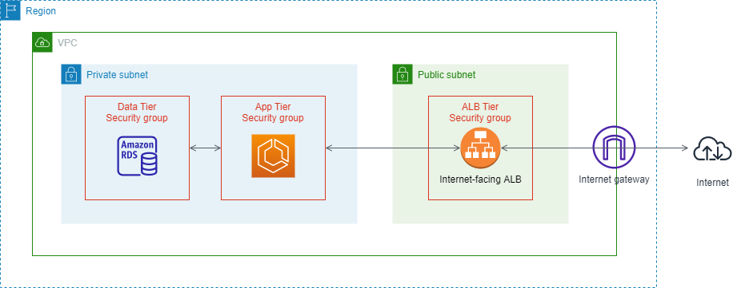

# An Internet facing CDK TypeScript project

Comparing with basic project, we use a internet-facing Application Load Balancer to expose web application to the Internet. But keep in mind, this solution is only for demo purpose, it's good practice to expose a service using domain name, instead of ALB DNS.

The infrastructure shows as below.



Main components:

- Three tiers network architecture
- Amazon RDS - MYSQL
- ECS Cluster managed by Auto Scaling Group
- Inernet-facing Application Load Balancer that targets several tasks running in ECS Cluster

## Stack Structure

| Stack Name            | Main AWS Resources                                                                   |
| --------------------- | ------------------------------------------------------------------------------------ |
| IamCdkStack           | ECS instance role and ECS task execution role                                        |
| VpcCdkStack           | VPC, Public Subnets, Private Subnets, Internet Gateway, NAT Gateway, Security Groups |
| EcsClusterCdkStack    | ECS Cluster, Instance Template, ASG                                                  |
| RdsCdkStack           | RDS MySQL Cluster                                                                    |
| EcsServiceAlbCdkStack | ECS Service, ALB, Target Group, Internet-facting ALB                                 |

## Install Dependencies

```sh
# install CDK dependencies
npm install

# install RDS init lambda function dependencies
cd lib/rds-init-fn-code
npm install
cd -
```

## Build Stacks

```sh
# cp .env.sample to .env, and replace `AWS_ACCOUNT_ID` and `AWS_REGION`
npm run build
```

## Deploy all above stacks into AWS

```sh
# take a cup of coffee, as the whole deployment will spend about 25 mins
npm run deploy
```

After deployment is done, verify all stacks is created completed. As the application is internet-facing, you can directly access the application via ALB DNS `internet-pokemon-dev-xxxxxxxxx.ap-south-1.elb.amazonaws.com`.

## Destory all stacks into AWS

```sh
# clear up resources to reduce cost. If you create a EC2 to verify the application, DON'T forget to terminate it before clear up all resources.
npm run destroy
```

## Throubleshooting

1. Get `SERVER IS UP` from health check endpoint, but fail to reach home page.

When MYSQL database is created, there is no database and tables on it. We use a Lambda function `MyRdsInit-ResInitRdsCdkStack` to initialize database and tables. But sometimes function cannot be invoked successfully during deploying. If you found error logs `sqlMessage: "Unknown database 'socka'",` from task logs, you need to invoke the function manually with a JSON payload in Console.

You can get the name of secret from the output of deployment, something like `arn:aws:secretsmanager:ap-south-1:xxxxxxxxx:secret:<the name of secret>`

```
{
  "params": {
    "config": {
      "credsSecretName": "The name of secret"
    }
  }
}
```

## Other Useful commands

- `npm run build` compile typescript to js
- `npm run watch` watch for changes and compile
- `npm run test` perform the jest unit tests
- `cdk deploy` deploy this stack to your default AWS account/region
- `cdk diff` compare deployed stack with current state
- `cdk synth` emits the synthesized CloudFormation template
