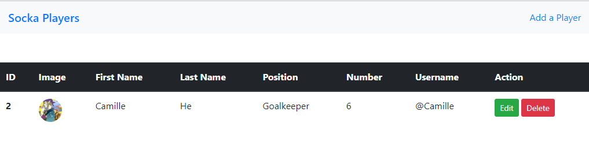

# A simple webapp that using NodeJS and MySQL database

The webapp is a simpele CRUD application using NodeJS and MYSQL for demo purpose. It allows you add players to a database and also display their details from the database. You can also delete and edit player details. The image below shows the app.



## Folder Structure

```
.
├── app.js
├── config
│   └── app.conf.js
├── connect.js
├── Dockerfile
├── helpers
│   └── aws
│       └── index.js
├── init-db.sql
├── package.json
├── package-lock.json
├── README.md
├── routes
│   ├── index.js
│   └── player.js
└── views
    ├── add-player.ejs
    ├── edit-player.ejs
    ├── index.ejs
    └── partials
        └── header.ejs
```

## Prerequisites

- Before you run this project on your local, you need to setup a MYSQL database on your local machine or romote server.

## Develop

```
npm install
npm start
```

## Build & Push docker image into docker hub

```
# build docker image
docker build . -t camillehe1992/webapp:latest

docker login

docker push camillehe1992/webapp:latest
```

## Reference

https://dev.to/achowba/build-a-simple-app-using-node-js-and-mysql-19me
